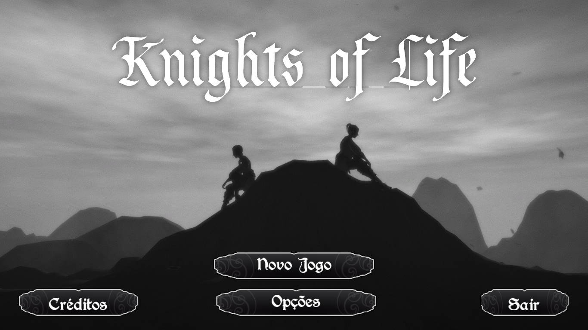
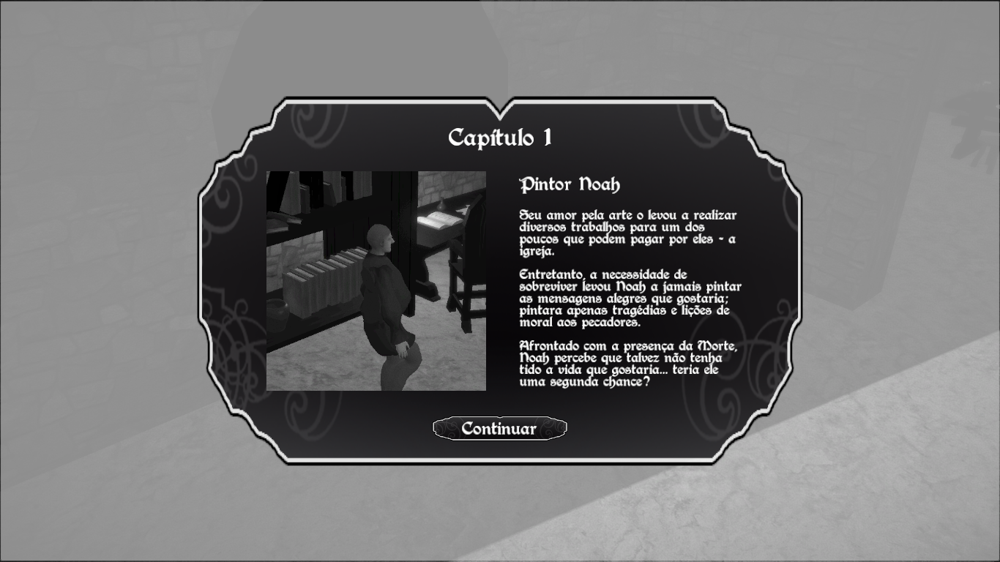

# Knights of Life

Unity version: 2018.2.14f1

[PT] Jogo 3D desenvolvido na Unity para o Inter do 6º Semestre do curso de Design de Games da Anhembi Morumbi.

Baseado no filme “O Sétimo Selo” (1957), de Ingmar Bergman, Knights of Life trás para o jogo a tensão de confrontar diretamente a Morte. Você pode escolher entre lutar pela sua vida ou pela vida de outras pessoas, impedindo ou não que a Morte leve-as ao desconhecido.
Nas mãos de um misterioso ou misteriosa personagem, cabe a você prever o próximo movimento da Morte e tomar alguma ação antes que seja tarde demais.
Interaja com objetos espalhados pelo cenário e desfaça as armadilhas mortais da Morte. Caso consiga proteger a vítima por um determinado tempo, sairá vencedor!Ou talvez não…?

[EN] 3D game developed in Unity for 6º Semester Game Design Course at Anhembi Morumbi.

Based on “The Seventh Seal” (1957) movie, by Ingmar Bergman, Knights of Life brings the tension of confront Death face to face. You can choose to fight for your life or for the others, stopping or not Death from taking them to the unkown.
As a mysterious character, it’s up to you foresee Death’s next move and take some action before it’s too late.
Interact with objects around the scene and undo Death’s deadly traps. If you protect the victim during a certain period of time, you win! Or maybe not…?

## Gameplay Video

Knights of Life gameplay video: https://youtu.be/shLNLns6rf8

## Screenshots

## Build

Link to download: https://drive.google.com/open?id=1cmACU0Nof5XCZacWahQSVV442zzM9xkZ

## Authors
- **Rafael Taue** - Game Designer, Programmer and Rigging - [GitHub](https://github.com/rtaue) - [Porfolio](https://rtaue.com) - [LinkedIn](https://www.linkedin.com/in/rtaue/)
- **Laís Rodrigues** - Game Designer, Artist, 3D Models and Animations - [ArtStation](https://www.artstation.com/marim) - [LinkedIn](https://www.linkedin.com/in/la%C3%ADs-rodrigues-548261149/)
